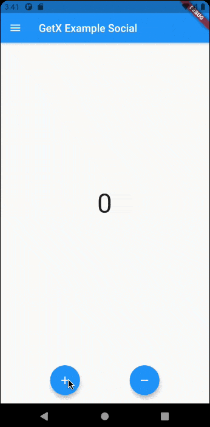

# GetX Example Social

Esse é um projeto de exemplo de como utilizar o GetX com conceitos de arquitura limpa.
O aplicativo possui 2 telas
- Home - É uma tela onde tem 2 botões, um que irá incrementar o valor do contador e outro que irá decrementar, tudo isso usando o esquema de reatividade do GetX.
    [Link da documentação da reatividade do GetX](https://github.com/jonataslaw/getx/blob/master/documentation/pt_BR/state_management.md)
- User - É uma tela que exibe uma lista de usuários vindo de uma [API fake](https://jsonplaceholder.typicode.com/), onde ao clicar em um usuário, será buscado em outra API a lista de posts desse comentário e também podendo clicar em cada post, para ver os comentários.

É um aplicativo apenas para fins didáticos.

## Demonstration

---
 
 
 

# Sobre o GetX

[Por que GetX](https://github.com/jonataslaw/getx/blob/master/README.pt-br.md#por-que-getx)

[Link do pacote no pub.dev](https://pub.dev/packages/get)

[Documentação em Português](https://github.com/jonataslaw/getx/blob/master/README.pt-br.md)

---
## [Pilares do GetX](https://github.com/jonataslaw/getx/blob/master/README.pt-br.md#os-tr%C3%AAs-pilares)
- [Gerenciamento de Estado](https://github.com/jonataslaw/getx/blob/master/documentation/pt_BR/state_management.md)
- [Gerenciamento de rotas](https://github.com/jonataslaw/getx/blob/master/documentation/pt_BR/route_management.md)
- [Gerenciamento de Dependência](https://github.com/jonataslaw/getx/blob/master/documentation/pt_BR/dependency_management.md)

---
## Produtividade
- [https://github.com/jonataslaw/get_cli](https://github.com/jonataslaw/get_cli)

---
## Padrões de organização de código

- É possível adaptar o uso do GetX na estrutura do seu projeto.
- [getx_pattern](https://kauemurakami.github.io/getx_pattern/)
    - [Snippets para VS Code](https://marketplace.visualstudio.com/items?itemName=get-snippets.get-snippets)
- [EKKO Boilerplate](https://github.com/Katekko/ekko_app)

---
## [Comunidade](https://pub.dev/packages/get#community)